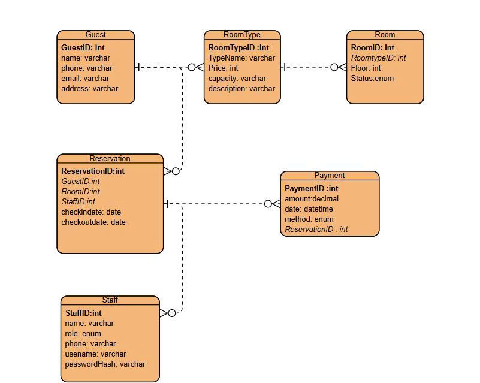
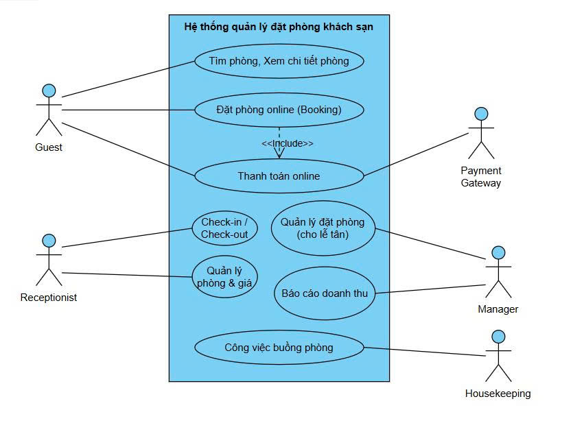
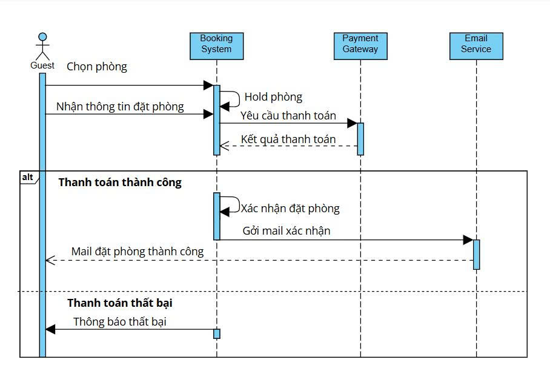
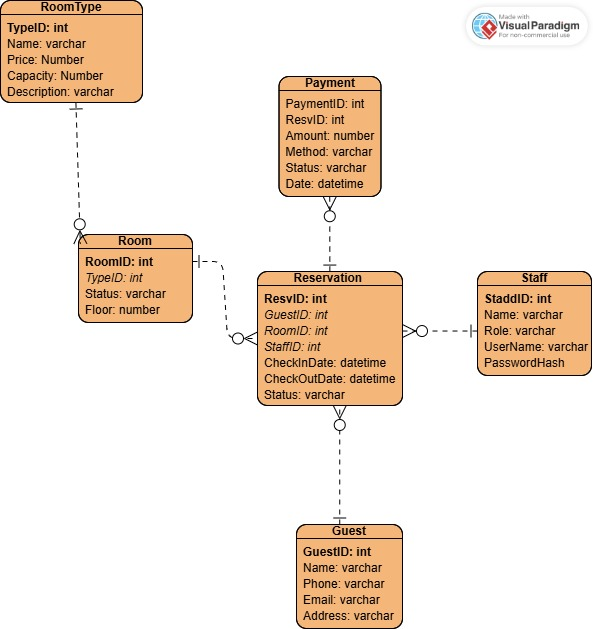

# Hotel Booking System – Lab 02

## 🎯 Mục tiêu
Dự án này được thực hiện trong khuôn khổ **Lab 02 – Phân tích yêu cầu & Thiết kế Use Case**.  
Sinh viên học cách:
- Phân tích yêu cầu hệ thống đặt phòng khách sạn
- Thiết kế Use Case Diagram, Sequence Diagram, ERD bằng UML
- Thiết kế cơ sở dữ liệu
- Triển khai quy trình Agile Scrum trên Jira
- Đồng bộ Jira ↔ GitHub qua Smart Commit

---

## 🏨 1. Thiết kế hệ thống

### 1.1 Các thực thể (Entity)
- **Guest** (Khách hàng)  
- **RoomType** (Loại phòng)  
- **Room** (Phòng cụ thể)  
- **Reservation** (Đặt phòng)  
- **Payment** (Thanh toán)  
- **Staff** (Nhân viên/Lễ tân/Quản lý)

**Quan hệ chính**:
- Guest 1–N Reservation  
- Reservation 1–N Payment  
- RoomType 1–N Room  
- Room 1–N Reservation  
- Staff 1–N Reservation  
📎 [Xem entity ]!
---

### 1.2 Use Case Diagram
Các tác nhân chính:
- Guest (Khách hàng)  
- Receptionist (Lễ tân)  
- Manager (Quản lý)  
- Payment Gateway  
- Housekeeping (Buồng phòng)  

Use case chính:
- Tìm phòng, Xem chi tiết phòng  
- Đặt phòng online (Booking)  
- Thanh toán online  
- Check-in / Check-out  
- Quản lý phòng & giá  
- Quản lý đặt phòng  
- Công việc buồng phòng  
- Báo cáo doanh thu  

📎 [Xem Use Case Diagram]

---

### 1.3 Sequence Diagram
- **Đặt phòng online**  
📎 [Xem Sequence Diagram A]

- **Check-in / Check-out**  
📎 [Xem Sequence Diagram B]

---

### 1.4 ERD (Entity Relationship Diagram)
📎 [Xem ERD]

---

## 📊 2. Agile Scrum (Jira)

### 2.1 Product Backlog
- Đăng ký/Đăng nhập khách hàng  
- Tìm phòng & Xem chi tiết phòng  
- Đặt phòng & thanh toán online  
- Check-in/Check-out (Lễ tân)  
- Quản lý phòng & giá (Manager)  
- Báo cáo doanh thu  
- Công việc buồng phòng  

### 2.2 Sprint Plan
- Sprint 1: Auth, Tìm phòng, Xem chi tiết phòng  
- Sprint 2: Đặt phòng & giữ chỗ  
- Sprint 3: Thanh toán & Check-in/out  
- Sprint 4: Báo cáo, housekeeping, tối ưu & release  

### 2.3 Board Workflow
- To Do → In Progress → Code Review → Testing → Done  

---

## 🔗 3. Jira ↔ GitHub đồng bộ
- Smart Commit format:  
HBS-18 Add: Use Case Diagram
HBS-19 Add: Sequence Diagram
HBS-20 Add: ERD
HBS-21 Add: README.md
- Khi commit kèm issue key (ví dụ: `HBS-7`), Jira sẽ tự động đồng bộ commit vào issue.

---

## 👩‍💻 4. Thông tin sinh viên
- Họ và tên: **Nguyễn Lê Tường Vi**  
- Môn học: Nhập môn công nghệ phần mềm 
- Lab: 02
